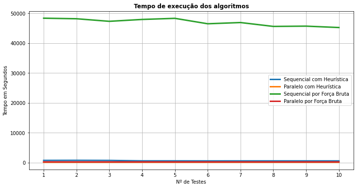

# Parallel-FullSearch
Aiming to bring an efficient method of the Full Search algorithm.
(i) The parallel solution for multi-core GPP using OpenMP library; (ii) The distributed solution for cluster/grid machines using Message Passing Library Interfaces (MPI).

In the file, for each frame, there are the data of the Y, Cb and Cr channels: The luminance channel has all pixels (640x360). The Cb and Cr channels have 
only 1/4 of the pixels (therefore, 320x180). Therefore, each frame must be read by reading a 640x360 matrix (Y Channel), and then two 320x180 matrices
(Cb and Cr Channels).

The Full Search algorithm aims to find the best match between the block of the current frame and all possible positions in the reference frame, with this, we have something related to a brute force, making the algorithm computationally more expensive, in terms of time, compared to other algorithms in the
literature. Despite the low performance, this algorithm is considered optimal because it is able to generate
Improved motion vectors, resulting in better video quality and better encoding efficiency.

## Folders View
```
├─ .images
│  └─ Output log graphs
├─ data
│  └─ Input video
├─ out
│  └─ Output logs for algorithms time
├─ reports
│  └─ Report with implementation and tests
├─ src
│  └─ Algorithms
└─ README.md

```

## Parallelism Results
### Average time of tests 
Sequential Algorithm with Heuristics 591.14s

Parallel Algorithm with Heuristics 86.30s

Brute Force Sequential Algorithm tests 46957.85s

Parallel Algorithm tests by Brute Force 197.94s

### Standard Deviation of tests
Sequential Algorithm with Heuristics 78.94s

Parallel Algorithm with Heuristics 0.32s

Brute Force Sequential Algorithm 1137.31s

Brute Force Parallel Algorithm 4.85s

### Variance of tests 
Sequential Algorithm with Heuristic 6230.96s

Parallel Algorithm with Heuristics 0.10s

Brute Force Sequential Algorithm 1293477.58s

Brute Force Parallel Algorithm tests 23.54s



